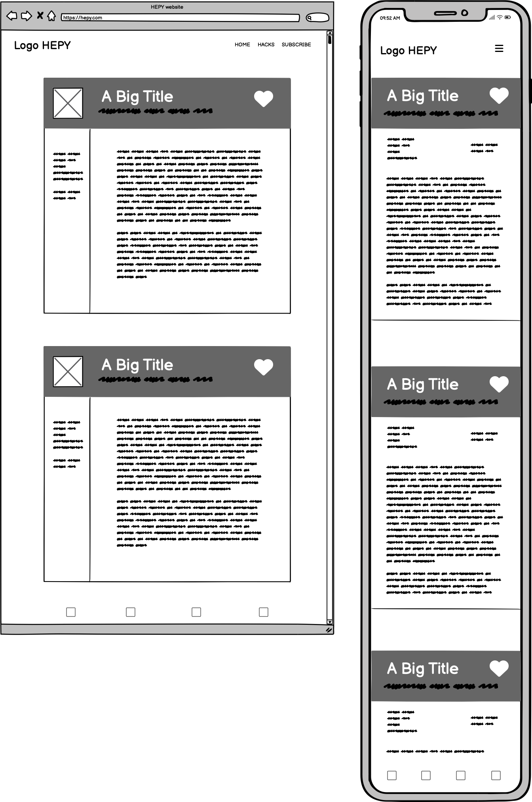

# HEPY Website

# Purpose
The HEPY project aims to create a platform where pet owners can discover clever tips, tricks, and solutions to make their lives with furry friends easier and more enjoyable.   
Targeted towards pet lovers seeking innovative ways to care for their pets, the website showcases practical advice and resources while emphasizing the appeal, taste, and quality of the provided solutions.

Our goals:
- You are happy
- Your pet is happy
- We are happy. But ONLY if you have subscribed.

The website is built using HTML and CSS as a Portfolio Project#1 for the Code Institute's Full Stack Developer(e-Commerce) course.  

[The live HEPY website](https://tayapro.github.io/just-works/)
___
# UX Design
## User stories
### As a **first time user**

- I want to easily navigate the website.
- I want to find helpful pet care tips and advice.
- I want to I want to easily find subscribe option. 

### As a **returning** and a **frequent user**

- I want to access and view the menu quickly and easily.
- I want to receive lifehacks by email.

## Features
### Existing Features

#### F01 Navigation Bar

#### F02 Landing Page image and call to action

### Future features

- Easily search for specific lifehacks by entering keywords or phrases into the search bar.
- Filter by lifehacks hashtags based on specific categories or topics that interest you.
- Counter keeps track of how many likes each lifehack receives, allowing you to see which ones are most popular among users.
- Navigation through the lifehacks page by scrolling up and down to discover a wide range of useful tips and tricks.

## Design
### Imagery

The HEPY website has just a few images, but they're simple and cozy. They show cute puppies wearing funny clothes and hats, which everyone finds adorable. Visitors can't help but smile when they see these charming pictures, and many feel an instant sense of warmth and joy while browsing the site.

### Colour Scheme

Colour scheme has been found on [coolors](https://coolors.co/palette/264653-2a9d8f-e9c46a-f4a261-e76f51). 
Palette has cool, warm colors temperature:

 #e76f51 - **Bloodletter**   
This colour evokes feelings of excitement, courage, and love.

 #f4a261 - **Shrimp Cocktail** 
The colour is often associated with creativity, enthusiasm, and warmth. 

 #e9c46a - **Bountiful Gold** 
This colour evokes feelings of comfort and energy, brings a sense of positivity and creativity.

 #2a9d8f - **Java** 
The colour reflects a matte and dusty aesthetic, brings a sense of tranquility and sophistication.

For contrast colors have been chosen following ones:
-  #3b3b3b - **Dead Pixel**
for background.
- and for the text pure white #ffffff.

### Typography

For this project Montserrat (logo and lifehack's titles) and Wix Madefor Display (body text) are used as fonts.  
Montserrat font is perfect for websites because it offers a clean, modern look. 
Wix Madefor Display font looks stylish and is easy to read.

### Wireframes

#### Main Page Wireframes

#### Lifehacks Wireframes

#### Subscribe Wireframes

## Technologies

### Languages
- HTML5
- CSS

### Frameworks, Libraries & Apps

| Name | Purpose |
|:-----|:--------|
| Google Fonts | Fonts |
| Font Awesome | Icons |
| Favicon.cc | Create website favicon |
| [Photopea](https://www.photopea.com/) | Work with images (resize, convert, etc) |
| [GoDaddy](https://www.godaddy.com/) | Generate logo |
| [Pixelcut](https://create.pixelcut.ai/background-remover) | Remove image's background |
| Balsamiq | Build interface website wireframes |
| Git | Use for version control |
| GitHub | Store the source code and deploy and host the live site |
| GitPod | Set up and run project code | 
| Google Chrome's Dev Tools | Inspect elements, layouts, debug pages |
| Google Chrome's Lighthouse | Check the performance, quality, and correctness of site |
| Google Chrome's Screen Reader | Test screen-reader accessibility |
| W3C HTML Markup Validator | Validate HTML code |
| W3C Jigsaw CSS Validator | Validate CSS code |

## Testing

### Validator Testing

#### HTML Validator

#### CSS Validator

### Browser Compatibility

Testing has been carried out on the following browsers :
- Chrome Version 124.0.6367.61 (Official Build) (arm64)
- Firefox Version 126.0.1 (64-bit)
- Safari on macOS Sanoma Version 14.4.1 

## Deployment

### How to fork and deploy

1. Fork GitHub [HEPY repository](https://github.com/tayapro/just-works).
2. In the GitHub repository, navigate to the **Settings** tab and select **Pages** from the left-hand menu.
3. In the source section drop-down menu, choose the **Main Branch** and click button **Save**.
3. Once the **Save** is clicked, the page will automatically refresh and display a detailed ribbon to indicate successful deployment.
4. Any changes pushed to the main branch will be reflected in the live project.

### How to clone

1. Visit the [HEPY repository](https://github.com/tayapro/just-works) on GitHub.
2. Click the **Code** button on the right side of the screen, select **HTTPs**, and copy the provided link.
3. Open a terminal and navigate to the directory where you want to clone the repository.
4. On the command line, type `git clone`, paste the copied URL, and press the **Enter** key to begin the process.

## Credits

### Content
- All content was written by the developer

### Media
- [Adult black puppy in yellow raincoat](https://unsplash.com/photos/adult-black-puppy-in-yellow-raincoat-lJJlaUWYrPE?utm_content=creditShareLink&utm_medium=referral&utm_source=unsplash) photo by [charlesdeluvio](https://unsplash.com/@charlesdeluvio)
- [Topless man with green and yellow cap](https://unsplash.com/photos/topless-man-with-green-and-yellow-cap-aGDvtArehQ4?utm_content=creditShareLink&utm_medium=referral&utm_source=unsplash) photo by [Karsten Winegeart](https://unsplash.com/@karsten116)
- [Pet toy icon](https://www.freepik.com/icon/pet-toy_8343881#fromView=search&page=1&position=0&uuid=18bd64b7-a315-439e-b716-0e12c7b3a5d5) generated by Freepik
- [Pet food icon](https://www.freepik.com/icon/pet-food_2143058#fromView=search&page=1&position=90&uuid=1ddef715-fae8-4c48-81c4-ab63308d9d14) generated by Freepik
- [Cat icon](https://www.freepik.com/icon/cat_8334214) generated by Freepik
- [Like icon](https://www.freepik.com/icon/like_148836#fromView=search&page=1&position=33&uuid=8eccb504-306e-4ad8-86dc-e8a8c2d389c6) by Smashicons
- [Man with idea](https://www.freepik.com/free-vector/business-man-trying-steal-idea_901028.htm#fromView=search&page=1&position=8&uuid=5a210eca-30b3-41bd-adb5-a3afa8dfb119) image by dooder on Freepik

### Code
- Gradient effect for logo and logo icon and buttons, [Cssgradient](https://cssgradient.io/blog/css-gradient-text/)
- Testimonials design has been found on [Mockplus](https://www.mockplus.com/blog/post/testinomial-page-design)
- Grid for Lifehacks page, [CSS tricks](https://css-tricks.com/snippets/css/complete-guide-grid/)

### Media
- The fonts used were imported from [Google Fonts](https://fonts.google.com/)
- The icons in the header, footer were taken from [Font Awesome](https://fontawesome.com/icons)

## Acknowledgments
I want to give a big thanks to my mentor, Ronan McClelland. He gave me awesome advice on how to plan and do this project.  
Plus, he showed me useful stuff for coding and testing.  
Thanks to the Slack Community for always being there to answer my questions, sometimes even before I asked them!