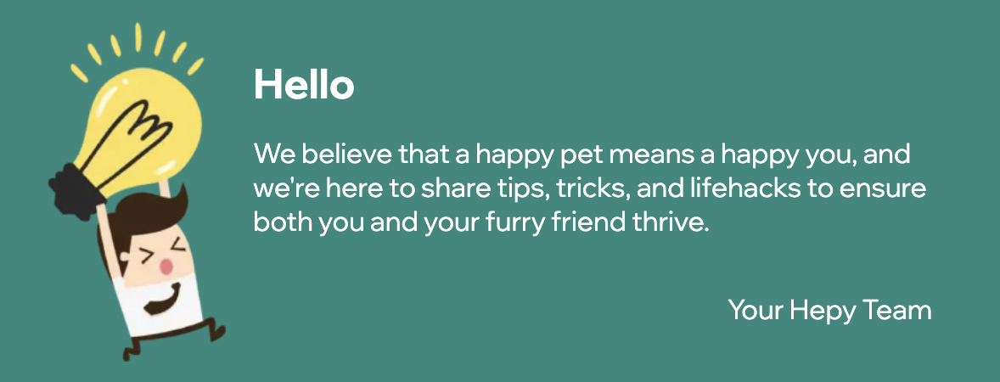
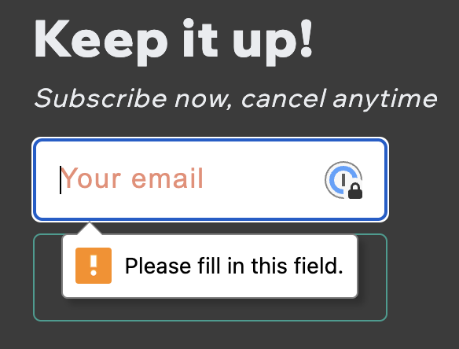
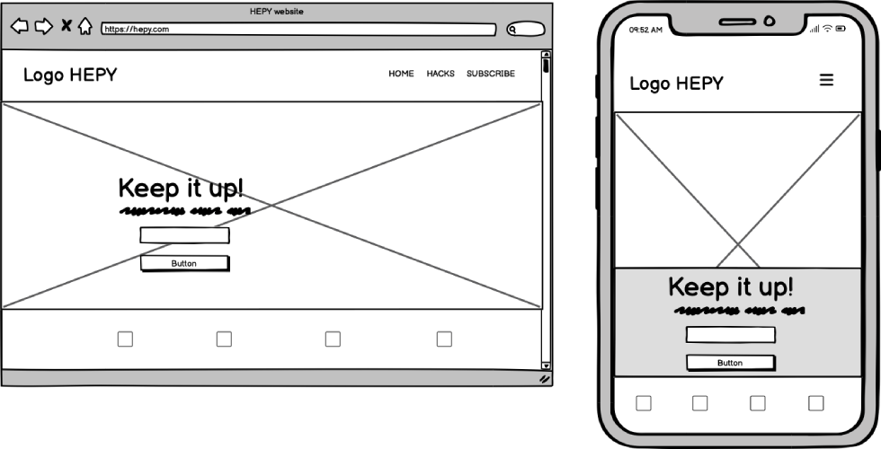
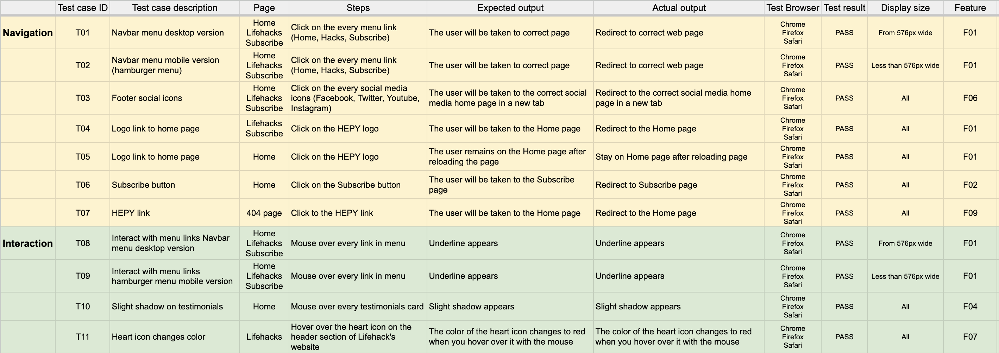
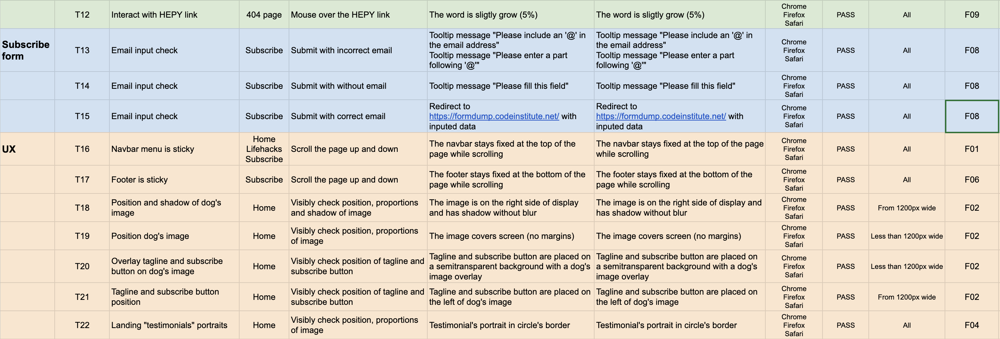
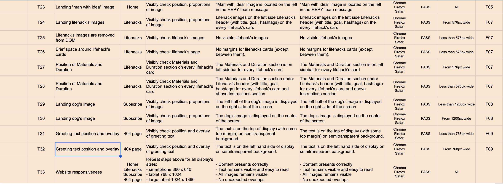
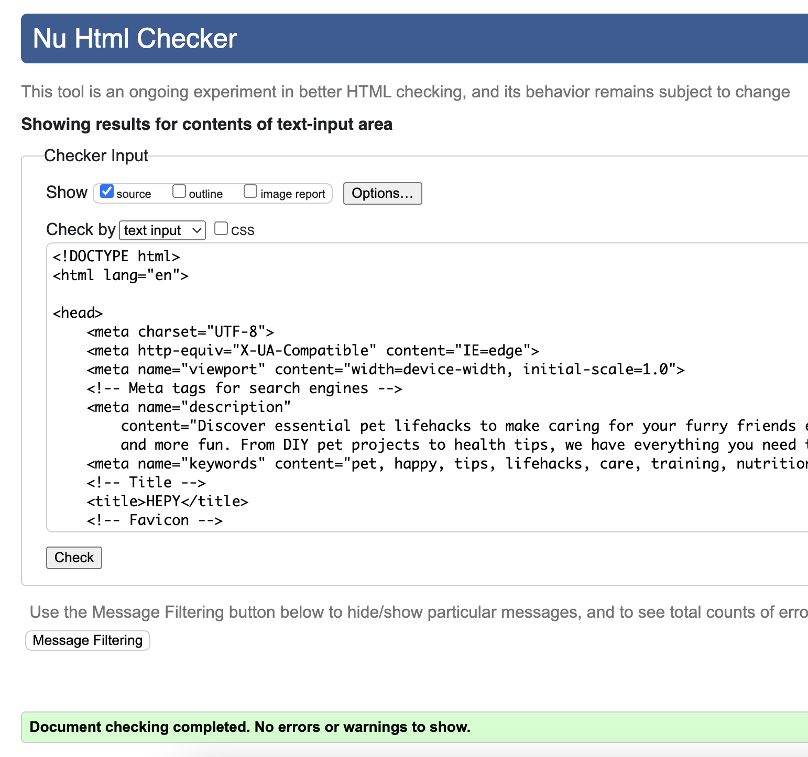

# HEPY Website

## Index – Table of Contents
* [Purpose](#purpose)
* [UX Design](#ux-design) 
* [Features](#features)
* [Design](#design)
* [Technologies](#technologies)
* [Testing](#testing)
* [Deployment](#deployment)
* [Credits](#credits)
* [Acknowledgments](#acknowledgments)

# Purpose
The HEPY project aims to create a platform where pet owners can discover clever tips, tricks, and solutions to make their lives with furry friends easier and more enjoyable.   
Targeted towards pet lovers seeking innovative ways to care for their pets, the website showcases practical advice and resources while emphasizing the appeal, taste, and quality of the provided solutions.

Our goals:
- You are happy
- Your pet is happy
- We are happy. <i>But ONLY if you have subscribed</i>.

The website is built using HTML and CSS as a Portfolio Project#1 for the Code Institute's Full Stack Developer(e-Commerce) course.  

[The live HEPY website](https://tayapro.github.io/just-works/)
___

# UX Design
## User stories
### As a **first time user**

- I want to easily navigate the website.
- I want to find helpful pet care tips and advice.
- I want to I want to easily find subscribe option. 

### As a **returning** and a **frequent user**

- I want to access and view the menu quickly and easily.
- I want to receive lifehacks by email.

# Features
## Existing Features

### F01 Navigation Bar

Each page has a sticky navigation bar at the top that is fully responsive. It includes a logo linking to the Home page, as well as links to the Home, Lifehacks and Subscribe pages. The navigation bar layout is consistent across all devices, making navigation simple and intuitive. The underline appears when you move the mouse over the menu links.

For mobile devices, it transforms into a compact "hamburger menu." This dropdown menu contains the same items, displayed in a column on a semitransparent background.

### F02 Home page - image and call to action

On the HEPY website, the first thing the user sees is a large photo of a cute black pug wearing a bright yellow raincoat.  
On mobile devices, this image takes up the entire screen, and the tagline with the subscribe button is superimposed over the picture.  
In the desktop version, the pug's photo has a black shadow on the right and bottom sides of the screen.

  
   

The photo, tagline, and text clearly convey the website's concept.  
Simple lines and color contrasts enhance this.

A large gradient text **Subscribe** button serves as an attention-grabbing call to action, guiding users to the subscribe page.

### F03 Home page - tagline

Who does not want to make their pet happy? Everyone does. 
**HAPPY PET. HAPPY YOU.**  
is a straightforward tagline that represents a concept of HEPY website.

### F04 Home page - testimonials 

Every lifehack website should feature testimonials from individuals who have successfully tried the hacks and their pets survived, and HEPY is no different. The reviews are displayed in a clean and attractive design with circular portraits. Additionally, the layout of this section is responsive, adjusting from a horizontal to a vertical display based on the width of the screen.

  
   

Also, every testimonial card has a light shadow if the user mouse over it.

### F05 Home page - HEPY team message

It's great to see personal messages for website visitors, and HEPY understands that. The last section of the home page includes a warm message from the HEPY team. The picture of the 'man with an idea' is memorable and a little funny.

### F06 Footer

The footer includes links to social media, enabling user engagement across multiple platforms.
It stay fixed to the bottom of all screens.

### F07 Lifehack page

What is a main puprose of lifehacks website? Straightforward and clear instructions. HEPY has it for every visitor. 
In the current version, the lifehacks page has only three life hacks because it does not have search functionality or filters by hashtags, for example. It shows the page for visitors who are new to HEPY portal and do not have full access yet.

Every lifehack card includes a header section featuring an image (for tablet and desktop), a title, goal, hashtags, and a like icon. Depending on the display size, the user may see the "Materials and Duration" section either on the left-hand side of the card or after the header section.

  
   

As one of the upcoming features, the HEPY website could provide a count of likes for each lifehack, allowing visitors to filter and view the most popular hacks on the HEPY portal.
The current stage of the project only has mouse hover interaction with the user, which changes the heart color from white to red.

   
   

### F08 Subscribe page

What is required to subscribe to HEPY pet lifehacks? Simply an email. Therefore, this page features a straightforward form to request a subscription. The input field checks the correctness of the provided email and will display an alert tooltip with instructions if any issues are found.

   
  
   

> [!NOTE]
> In the current stage of the project, without JS implementation, the only way to check the correctness of data in a POST request is to redirect to the Code Institute page.

To enhance the user experience, the Subscribe page showcases a background image of an adorable puppy wearing a fun hat. The vibrant colors of the image are consistent with the website's color palette.
To ensure that every visitor can see at least half of the adorable puppy, the subscribe page has a display with the left half of the dog's image on small displays and overlaid subscribtion form.

  
   

### F09 page 404

The 404 page design looks plain, even the cat's picture lacks color details. 
This gray cat seems to be ignoring you, as if it's silently questioning, "Why are you here?"
The linkable word "HEPY" in a gradient color helps users find their way back to the HEPY pet lifehacks home page.
Hover the "HEPY" link has a hover effect, it slightly grows (5%).

  
   

## Future features

> - Easily search for specific lifehacks by entering keywords or phrases into the search bar.
> - Filter by lifehacks hashtags based on specific categories or topics that interest you.
> - Counter keeps track of how many likes each lifehack receives, allowing you to see which ones are most popular among users.
> - Navigation through the lifehacks page by scrolling up and down to discover a wide range of useful tips and tricks.
> - Create a personal account to save the favorite lifehacks.

# Design
## Imagery

The HEPY website has just a few images, but they are simple and cozy. They show cute puppies wearing funny clothes and hats, which everyone finds adorable. Visitors can not help but smile when they see these charming pictures, and many feel an instant sense of warmth and joy while browsing the site.

## Colour Scheme

Colour scheme has been found on [coolors](https://coolors.co/palette/264653-2a9d8f-e9c46a-f4a261-e76f51). 
Palette has cool, warm colors temperature:

 #e76f51 - **Bloodletter**   
This colour evokes feelings of excitement, courage, and love.

 #f4a261 - **Shrimp Cocktail** 
The colour is often associated with creativity, enthusiasm, and warmth. 

 #e9c46a - **Bountiful Gold** 
This colour evokes feelings of comfort and energy, brings a sense of positivity and creativity.

 #2a9d8f - **Java** 
The colour reflects a matte and dusty aesthetic, brings a sense of tranquility and sophistication.

For contrast colors have been chosen following ones:
-  #3b3b3b - **Dead Pixel**
for background and testimonials.
- and pure white #ffffff for the text.

## Typography

For this project Montserrat (logo and lifehack's titles) and Wix Madefor Display (body text) are used as fonts.  
Montserrat font is perfect for websites because it offers a clean, modern look. 
Wix Madefor Display font looks stylish and is easy to read.

## Wireframes

### Main Page Wireframes

### Lifehacks Wireframes

### Subscribe Wireframes

# Technologies

## Languages
- HTML5
- CSS

## Frameworks, Libraries & Apps

| Name | Purpose |
|:-----|:--------|
| Google Fonts | Fonts |
| Font Awesome | Icons |
| Favicon.cc | Create website favicon |
| [Photopea](https://www.photopea.com/) | Work with images (resize, convert, etc) |
| [GoDaddy](https://www.godaddy.com/) | Generate HEPY logo |
| [Pixelcut](https://create.pixelcut.ai/background-remover) | Remove image's background |
| Balsamiq | Build interface website wireframes |
| Git | Use for version control |
| GitHub | Store the source code and deploy and host the live site |
| GitPod | Set up and run project code | 
| Google Chrome's Dev Tools | Inspect elements, layouts, debug pages |
| Google Chrome's Lighthouse | Check the performance, quality, and correctness of site |
| Google Chrome's Screen Reader | Test screen-reader accessibility |
| W3C HTML Markup Validator | Validate HTML code |
| W3C Jigsaw CSS Validator | Validate CSS code |

# Testing

## Features testing

[Test results](https://docs.google.com/spreadsheets/d/1AaDg1mBbehy85AYhfLXJV3IuHkJzbHoVTAyRkfmix3Y/edit#gid=1254839632) as Google sheets.

Responsive layout has been check for all screen sizes, and focused on most popular, based on [screen-resolution-stats](https://gs.statcounter.com/screen-resolution-stats/all/worldwide/2023).

## Validator testing

### HTML Validator

The W3C Markup Validation Service was employed to check the HTML of the website.   
All pages passed without any errors or warnings.

Home

Lifehacks

Subscribe

404 page

### CSS Validator

The W3C Jigsaw CSS Validation Service was employed to check the HTML of the website.   
The CSS page passed without any errors or warnings.

CSS

## Performance 
Google Lighthouse in Google Chrome Developer Tools was used to check the website performance.

### Home

Home desktop

Home mobile

### Lifehacks

Lifehacks desktop

Lifehacks mobile

### Subscribe

Subscribe desktop

Subscribe mobile

### 404 page

404 page desktop

404 page mobile

## Device/Browser Compatibility

Testing has been carried out on the following devices:

1. Macbook Sanoma Version 14.4.1:

   - Chrome Version 124.0.6367.61 (Official Build) (arm64)
   - Firefox Version 126.0.1 (64-bit)
   - Safari  

2. Samsung S20:
   - Chrome Version 125.0.6422.165
   - Samsung Internet Version 25.0.1.3

3. iPad Air 5th generation:
   - Safari
   - Chrome

4. Windows PC:
   - Chrome Version 124.0.6367.61 (Official Build) (arm64)

# Deployment

## How to fork and deploy

1. Fork GitHub [HEPY repository](https://github.com/tayapro/just-works).
2. In the GitHub repository, navigate to the **Settings** tab and select **Pages** from the left-hand menu.
3. In the source section drop-down menu, choose the **Main Branch** and click button **Save**.
3. Once the **Save** is clicked, the page will automatically refresh and display a detailed ribbon to indicate successful deployment.
4. Any changes pushed to the main branch will be reflected in the live project.

## How to clone

1. Visit the [HEPY repository](https://github.com/tayapro/just-works) on GitHub.
2. Click the **Code** button on the right side of the screen, select **HTTPs**, and copy the provided link.
3. Open a terminal and navigate to the directory where you want to clone the repository.
4. On the command line, type `git clone`, paste the copied URL, and press the **Enter** key to begin the process.

# Credits

## Content

- The hamburger menu for mobile devices and footer icons as ideas were taken from "Love running" lesson.
- All other content was written by the developer.

## Media
- [Adult black puppy in yellow raincoat](https://unsplash.com/photos/adult-black-puppy-in-yellow-raincoat-lJJlaUWYrPE?utm_content=creditShareLink&utm_medium=referral&utm_source=unsplash) photo by [charlesdeluvio](https://unsplash.com/@charlesdeluvio)
- [Topless man with green and yellow cap](https://unsplash.com/photos/topless-man-with-green-and-yellow-cap-aGDvtArehQ4?utm_content=creditShareLink&utm_medium=referral&utm_source=unsplash) photo by [Karsten Winegeart](https://unsplash.com/@karsten116)
- [Pet toy icon](https://www.freepik.com/icon/pet-toy_8343881#fromView=search&page=1&position=0&uuid=18bd64b7-a315-439e-b716-0e12c7b3a5d5) generated by Freepik
- [Pet food icon](https://www.freepik.com/icon/pet-food_2143058#fromView=search&page=1&position=90&uuid=1ddef715-fae8-4c48-81c4-ab63308d9d14) generated by Freepik
- [Cat icon](https://www.freepik.com/icon/cat_8334214) generated by Freepik
- [Like icon](https://www.freepik.com/icon/like_148836#fromView=search&page=1&position=33&uuid=8eccb504-306e-4ad8-86dc-e8a8c2d389c6) by Smashicons
- [Man with idea](https://www.freepik.com/free-vector/business-man-trying-steal-idea_901028.htm#fromView=search&page=1&position=8&uuid=5a210eca-30b3-41bd-adb5-a3afa8dfb119) image by dooder on Freepik

## Code
- Gradient effect for logo and logo icon and buttons, [Cssgradient](https://cssgradient.io/blog/css-gradient-text/)
- Testimonials design has been found on [Mockplus](https://www.mockplus.com/blog/post/testinomial-page-design)
- Grid for Lifehacks page, [CSS tricks](https://css-tricks.com/snippets/css/complete-guide-grid/)

## Media
- The fonts used were imported from [Google Fonts](https://fonts.google.com/)
- The icons in the header, footer were taken from [Font Awesome](https://fontawesome.com/icons)

# Acknowledgments
I want to give a big thanks to my mentor, Ronan McClelland. He gave me awesome advice on how to plan and do this project.  
Plus, he showed me useful stuff for coding and testing.  
Thanks to the Slack Community for always being there to answer my questions, sometimes even before I asked them!

<h2><i>No pets were harmed during the creation of this website — unless you count a few extra belly rubs and treats!</i></h2>